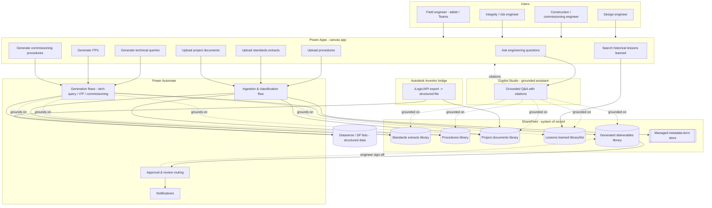

# Engineering Knowledge Assistant - Solution Architecture

- **Title:** Engineering Knowledge Assistant (EKA) - Solution Architecture
- **Version:** 0.1.0
- **Status:** Draft
- **Last updated:** 2025 (foundation feature FEAT-001)
- **Audience:** Solution architects, Power Platform makers, engineering leads
- **Domain:** Gas transmission & distribution (T&D) engineering knowledge

> **Scope note.** This document is a design artifact. The development sandbox is a
> Linux/web environment and **cannot deploy to a Power Platform tenant**. Everything
> here is declarative/design-only and intended for import or implementation in the
> target tenant by qualified makers and engineers.

---

## 1. Purpose

The Engineering Knowledge Assistant (EKA) helps gas T&D engineers get grounded,
standards-compliant answers and generate engineering deliverables. It is built on
the **Microsoft Power Platform** with **SharePoint as the document repository and
system of record**, and an **Autodesk Inventor** export bridge for CAD-derived data.

EKA is a **program of composable modules**, not a single app. The foundation defined
here (solution + information architecture) is a prerequisite for every capability
module.

---

## 2. System components

| Component | Role |
|---|---|
| **SharePoint Online** | System of record / **document repository**. Holds standards extracts, procedures, project documents, lessons learned, and generated deliverables. Provides content types, managed metadata, and the grounding source for the assistant. |
| **Power Apps (canvas)** | User-facing app for ask / upload / search, including tablet and Teams use by field engineers. |
| **Power Apps (model-driven)** | Optional structured, data-heavy workflows (e.g. ITP line-item management) backed by Dataverse. |
| **Power Automate** | Orchestration: document ingestion & classification, deliverable generation, approvals, notifications, system-to-system integration. |
| **Microsoft Copilot / Copilot Studio** | Document-grounded conversational assistant. Topics/agents grounded on SharePoint content, answering **with citations**. |
| **Dataverse / SharePoint lists** | Structured data (ITP records, technical-query register, generation audit trail, taxonomy-backed metadata). |
| **Autodesk Inventor (desktop CAD)** | Source of engineering model data (BOM, parameters, drawing metadata). Integrated via an **export step**, not a live connection. |

---

## 3. End-to-end data flow

**Narrative:**

1. **Upload** (procedures, standards extracts, project documents) enters through the
   canvas app, is picked up by the **ingestion & classification flow**, tagged with
   managed metadata, and filed into the correct SharePoint library.
2. **Ask engineering questions** goes to **Copilot Studio**, which answers grounded on
   SharePoint content and returns **citations** (see §4).
3. **Search historical lessons learned** queries the dedicated lessons-learned
   library/list filtered by capability, asset type, and project.
4. **Generation** (technical queries, ITPs, commissioning procedures) runs through
   generation flows that ground on repository content, write a **DRAFT** deliverable to
   the generated-deliverables library, and route it for engineering review (§5).
5. The **Inventor bridge** exports CAD-derived data (BOM/parameters/drawing metadata)
   to Dataverse and/or the project-documents library for use by generators and Q&A.

---

## 4. Grounding model

EKA is **grounded, not generative-from-memory**.

- Copilot answers are grounded on **SharePoint content** and return **citations** that
  identify the source document and, where the source provides it, the
  **clause/section and revision/year**.
- The assistant **never invents** clause numbers, acceptance criteria, or requirements.
  Where a standard's text is not available in the repository (e.g. pending licensing),
  the assistant states that the source is unavailable and defers to the authoritative
  document rather than guessing.
- **Structured data** (ITP records, technical-query register, generation audit trail,
  taxonomy values) lives in **Dataverse or SharePoint lists**. Narrative/source content
  lives in SharePoint document libraries.
- Retrieval quality depends on the information architecture (content types + managed
  metadata) defined in [information-architecture.md](../information-arch/information-architecture.md).

> **Safety-critical reminder.** Gas T&D is high-consequence. When uncertain, the
> assistant states uncertainty and defers to the authoritative document and the
> responsible engineer.

---

## 5. Human-in-the-loop

- Every generated deliverable (technical query, ITP, commissioning procedure, risk
  assessment, etc.) is produced as a **DRAFT**.
- Generated deliverables carry a visible **"DRAFT — pending engineering review"**
  marker until a qualified engineer reviews and signs off.
- Power Automate routes drafts through **approval/review** before a deliverable is
  marked Approved; status transitions (Draft → In Review → Approved) are tracked via
  the `document-status` metadata column.
- The assistant **drafts and advises**; the responsible engineer **decides**.

---

## 6. Capability mapping

### 6.1 User capabilities → capability areas → modules

The eight user capabilities from the request map to the nine product capability areas
and to implementing modules as follows.

| # | User capability (from request) | Product capability area(s) | Module (capability shorthand) |
|---|---|---|---|
| 1 | Ask engineering questions | Technical queries; AS2885 compliance; AS4645 compliance; Welding; Design reviews | `tech-query` (grounded Q&A), drawing on `as2885`, `as4645`, `welding`, `design-review` |
| 2 | Upload procedures | (Foundation - ingestion) feeds Commissioning, Construction | `ingestion` → `commissioning`, `construction` |
| 3 | Upload standards extracts | (Foundation - ingestion) feeds AS2885, AS4645, Welding | `ingestion` → `as2885`, `as4645`, `welding` |
| 4 | Upload project documents | (Foundation - ingestion) feeds all modules | `ingestion` → all |
| 5 | Search historical lessons learned | Technical queries; Risk assessments; Design reviews | `lessons-learned` (library + search), surfaced in `tech-query`, `risk-assessment`, `design-review` |
| 6 | Generate technical queries | Technical queries | `tech-query` (generator) |
| 7 | Generate ITPs | ITP generation | `itp` |
| 8 | Generate commissioning procedures | Commissioning procedures | `commissioning` |

### 6.2 The nine product capability areas

| Capability area | Shorthand | Scope | Covered by user capability |
|---|---|---|---|
| AS2885 compliance | `as2885` | **Transmission** pipeline systems (petroleum & gas) | 1, 3 |
| AS4645 compliance | `as4645` | **Distribution** gas networks | 1, 3 |
| Commissioning procedures | `commissioning` | Generation & guidance | 2, 8 |
| Welding requirements | `welding` | WPS/PQR guidance, standards lookups | 1, 3 |
| ITP generation | `itp` | Inspection & Test Plans | 7 |
| Design reviews | `design-review` | Checklists, standards cross-checks | 1, 5 |
| Construction support | `construction` | On-site technical guidance | 2 |
| Risk assessments | `risk-assessment` | Safety management studies, hazard ID | 5 |
| Technical queries | `tech-query` | General document-grounded Q&A | 1, 5, 6 |

> **Note.** AS2885 (transmission) and AS4645 (distribution) are kept **distinct**: their
> scope and requirements differ and must not be merged in grounding, taxonomy, or
> generation logic.

---

## 7. Autodesk Inventor bridge

Inventor is desktop CAD software; EKA integrates via an **export step**, not a live
Power Platform connection.

| Aspect | Design intent |
|---|---|
| **Trigger** | Engineer runs an export (Inventor iLogic / Inventor API) from the desktop model. |
| **Extracted data** | **[OPEN QUESTION - see §8]** Candidate scope: Bill of Materials (BOM), model parameters, drawing metadata. |
| **Transport** | iLogic/API → structured file (e.g. JSON/CSV) → uploaded to SharePoint project-documents library and/or pushed to Dataverse. |
| **Consumers** | ITP and commissioning generators; technical-query grounding. |

The exact extraction scope is an **open question** (§8) and must be resolved before the
Inventor-dependent parts of any module are built.

---

## 8. Assumptions, risks & open questions

These are the three open questions from the product definition. They are surfaced here
as **explicit, unresolved** items. They are **not silently decided**.

| # | Open question | Type | Status | Impact |
|---|---|---|---|---|
| OQ-1 | **Standards licensing** - AS2885/AS4645 are copyrighted Standards Australia documents. Confirm licensing to index/ground AI on their text. | Hard dependency | **Unresolved** | **Blocks** any module that grounds on standard text (`as2885`, `as4645`, `welding` standards lookups, and standards cross-checks in `design-review`). Until confirmed, those modules use clearly-marked placeholders and cannot ground on standard clauses. |
| OQ-2 | **Inventor integration scope** - what is extracted (BOM, parameters, drawing metadata) and how it reaches the platform. | Scope / integration | **Unresolved** | Blocks the Inventor-dependent portions of `itp` and `commissioning` and any CAD-grounded Q&A. Does not block document-grounded Q&A. |
| OQ-3 | **First-module selection** - which capability is designed end-to-end first. | Sequencing | **Recommendation offered (below), decision deferred to the team** | Determines program sequencing. |

### 8.1 Recommended first module (recommendation, not a decision)

**Recommendation:** make **document-grounded Q&A (`tech-query`) on the SharePoint
information architecture + ingestion** the first end-to-end module, with **ITP
generation (`itp`) as the first generator**.

**Rationale:**

- Q&A exercises the **foundation** (ingestion → SharePoint IA → Copilot grounding +
  citations) that every other module depends on, so it validates the architecture
  earliest.
- Q&A can deliver value **without** depending on the standards-licensing question
  (OQ-1): it can ground on user-uploaded procedures, project documents, and lessons
  learned immediately, and add standards grounding once OQ-1 is resolved.
- **ITP generation** is the natural first generator: it has well-structured,
  table-oriented output (ITP line items), exercises the human-in-the-loop review path,
  and benefits directly from the Inventor bridge once OQ-2 is resolved.
- This satisfies the **modular-delivery** principle: deliver one capability end-to-end
  before expanding.

> This remains a **recommendation**. The responsible team should confirm the first
> module and record the decision before building the relevant module.

### 8.2 Other assumptions

| ID | Assumption |
|---|---|
| A-1 | SharePoint Online is the single document repository / system of record. |
| A-2 | Users authenticate with organisational Microsoft 365 identities; access control is enforced by SharePoint/Dataverse permissions (detailed design out of scope for FEAT-001). |
| A-3 | All generated deliverables are drafts requiring qualified-engineer review and sign-off. |
| A-4 | The sandbox cannot deploy to a tenant; artifacts are declarative/design-only. |

---

## 9. Related documents

- [Information Architecture](../information-arch/information-architecture.md) - SharePoint
  libraries, taxonomy/term sets, content types, metadata columns.
- Per-module design docs will live under `docs/modules/` as modules are started.
